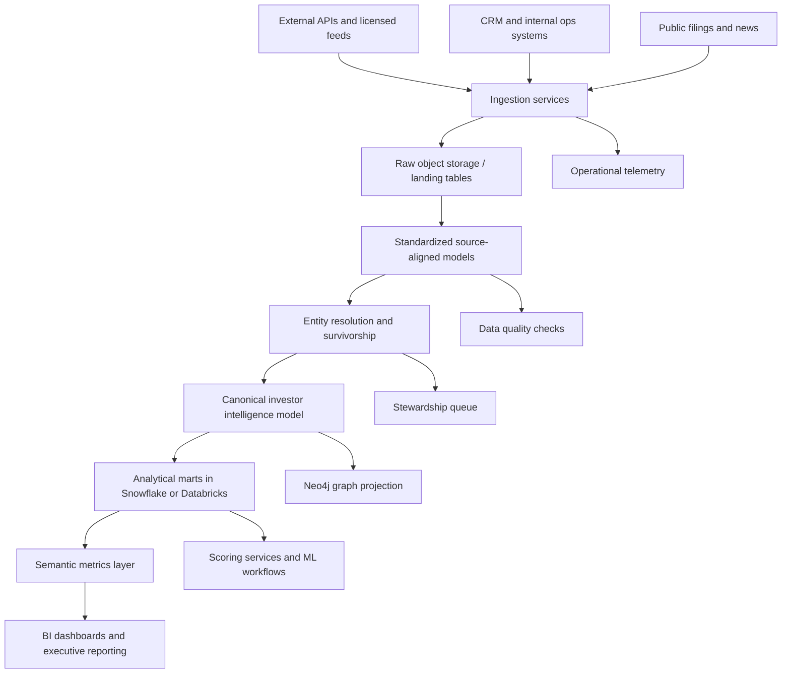

# Architecture

## Executive overview
The platform is designed as an enterprise capital-raising intelligence backbone. Its primary purpose is to create a trusted, reusable data asset that supports investor origination, fundraising performance management, relationship intelligence, and executive reporting across fundraising teams, finance, strategy, and leadership.

## Architectural goals
- unify fragmented investor and fundraising data across external and internal systems
- establish canonical entities and governed golden records
- separate ingestion concerns from analytical consumption
- enable both tabular analytics and graph-driven relationship intelligence
- support low-latency signal ingestion and batch warehouse harmonization
- preserve lineage, source attribution, and auditability for high-stakes decisions

## Layered architecture

### 1. Source systems
The source estate combines external commercial datasets, public domain data, and internal relationship systems:

- Crunchbase-like market intelligence APIs for company, investor, and funding round data
- PitchBook-like files or licensed feeds for investment activity and fund metadata
- SEC filings, firm websites, and public disclosures for verification and enrichment
- news and event streams for trigger-based fundraising signals
- Salesforce or equivalent CRM for account, contact, meeting, and pipeline history
- internal fundraising trackers, diligence logs, and outreach activity data

### 2. Ingestion and raw landing
Source-specific collectors pull from REST APIs, scheduled files, object storage drops, and streaming signal feeds. The raw landing zone preserves source payloads with immutable ingestion metadata:

- source system identifier
- extraction timestamp
- batch or event identifier
- record hash
- ingestion status

This pattern provides replayability, auditability, and schema drift detection.

### 3. Standardization
Standardized models normalize source-specific schemas into common structures for investors, funds, companies, people, fundraising events, and relationships. This layer is intentionally loss-minimizing: source fidelity is retained while formats, timestamps, identifiers, and controlled vocabulary fields are harmonized.

### 4. Canonicalization and entity resolution
Canonical services consolidate duplicate representations across sources using deterministic and probabilistic matching. Each canonical record stores:

- a durable enterprise key
- best-known attributes
- survivorship logic outputs
- match confidence
- contributing source records
- stewardship and review status

This is the platform’s authoritative intelligence core.

### 5. Analytical marts
Canonical data is reshaped into purpose-built marts:

- investor targeting mart
- fundraising performance mart
- relationship intelligence mart
- pipeline velocity mart
- executive KPI mart

Marts are optimized for BI tools, semantic layers, and downstream data science features.

### 6. Semantic and consumption layer
Business-facing metrics are curated around shared definitions such as active target investor, warm relationship, qualified fundraising signal, round progression rate, and coverage ratio. This reduces dashboard drift and metric disagreement across operating teams.

### 7. Optional graph intelligence
Neo4j can be introduced when relationship traversal becomes a priority. Canonical investors, firms, people, boards, funds, portfolio companies, and events are projected as nodes and edges to answer questions like:

- Which investors are two hops away through current LPs or advisors?
- Which partner relationships correlate with successful second meetings?
- Which portfolio adjacency patterns suggest likely interest in a new thesis area?

## Deployment architecture

### Recommended control plane
- Airflow for orchestration, dependency management, SLA monitoring, and operational recovery
- GitHub Actions for CI/CD and deployment promotion
- Great Expectations or SQL-based assertions for data quality
- OpenLineage-compatible metadata collectors for lineage capture
- Prometheus and Grafana or Datadog for pipeline telemetry

### Recommended data plane
- Object storage landing zone for raw files and API payload archives
- Snowflake or Databricks as the analytical warehouse or lakehouse
- dbt-style SQL transformations for curated models
- Neo4j for optional graph workloads

## Architectural tradeoffs
- Snowflake vs Databricks: Snowflake is simpler for warehouse-first analytics teams; Databricks is stronger if feature engineering, ML, and large-scale semi-structured processing are central.
- Canonical warehouse model vs graph-first design: canonical warehouse tables remain the system of analytical record; graph projection is additive for relationship-heavy use cases.
- Batch-first vs near-real-time ingestion: investor targeting tolerates hourly or daily refresh; signal-triggering and alerts may justify event-driven ingestion.

## Non-functional requirements
- lineage for every business-critical metric
- idempotent ingestion and replay support
- PII-aware access controls
- quality thresholds for canonical publish steps
- environment promotion with automated tests
- cost observability for source ingestion and warehouse compute

## End-to-end architecture flow

## Operating model
The architecture assumes a federated but governed delivery model:

- data engineering owns ingestion, standardization, orchestration, and platform reliability
- data architecture owns canonical model stewardship, integration patterns, and standards
- analytics engineering owns marts, semantic metrics, and reporting consistency
- data science owns prioritization models and experimental scoring features
- business stewards resolve low-confidence entity matches and authoritative source conflicts
