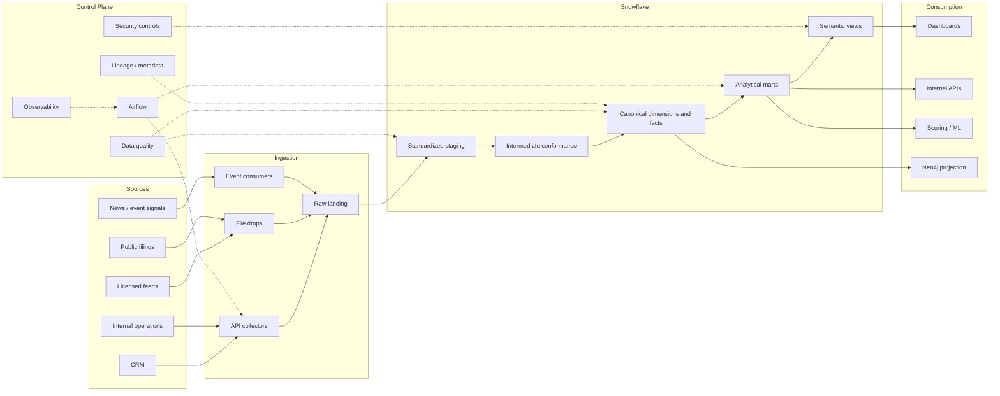

# Capital Raising Data Platform

Snowflake-first data platform for investor intelligence, fundraising execution, relationship analytics, and executive reporting.

## Platform responsibilities
This repository contains the platform assets used to ingest, standardize, govern, model, and publish capital-raising intelligence data products. The system consolidates:

- external market intelligence feeds
- public filings and news-derived fundraising signals
- CRM relationship and outreach activity
- internally curated company, fund, and pipeline records

The platform’s primary outputs are governed warehouse tables and marts that support:

- investor targeting and qualification
- outreach prioritization and relationship coverage
- fundraising funnel and velocity reporting
- executive KPI reporting
- graph-style relationship intelligence where Neo4j is enabled

## Operating principles
- SQL-first transformations: business logic, KPI definitions, marts, and reconciliation checks live in Snowflake SQL and dbt-style models
- Python only where it is the right fit: ingestion, orchestration, utility helpers, file handling, and ML-specific workflows
- Canonical record discipline: investor, company, fund, and person identities are standardized and survivorship-managed before downstream reporting
- Operational transparency: lineage, quality checks, freshness, SLA ownership, and rollback procedures are documented alongside the code

## Repository map
- [ARCHITECTURE.md](ARCHITECTURE.md): service boundaries, deployment model, and control plane
- [DATA_MODEL.md](DATA_MODEL.md): conceptual, logical, and physical warehouse design
- [PIPELINES.md](PIPELINES.md): ingestion and transformation workflow design
- [DATA_CONTRACTS.md](DATA_CONTRACTS.md): source contracts and ingestion expectations
- [SEMANTIC_LAYER.md](SEMANTIC_LAYER.md): business-facing metrics and semantic dataset definitions
- [OPERATING_MODEL.md](OPERATING_MODEL.md): ownership model, SLAs, and service boundaries
- [RUNBOOK.md](RUNBOOK.md): operator guidance and incident handling
- [sql](sql): warehouse DDL, marts, semantic views, reconciliation, and test queries
- [models](models): dbt-style staging, intermediate, and mart models
- [src](src): ingestion, orchestration, utilities, and ML helpers
- [infrastructure](infrastructure): Snowflake, Airflow, and object storage deployment notes

## Data flow


## Local workflow
```bash
cd capital-raising-data-platform
python3 -m venv .venv
source .venv/bin/activate
pip install -r requirements.txt
export PYTHONPATH=.
python -m src.ingestion.api_clients
python -m src.ingestion.crm_client
python -m src.ml.train_forecast
pytest
```

## Warehouse execution order
1. Apply [sql/schema.sql](sql/schema.sql)
2. Materialize dbt-style models under [models](models)
3. Apply semantic and reporting SQL under [sql/marts.sql](sql/marts.sql) and [sql/semantic_metrics.sql](sql/semantic_metrics.sql)
4. Run [sql/tests.sql](sql/tests.sql), [sql/reconciliation.sql](sql/reconciliation.sql), and [sql/monitoring.sql](sql/monitoring.sql)

## Diagram assets
The `docs/*.png` assets are text-based diagram placeholders that embed Mermaid source. They keep the repository self-contained in environments where image rendering is not available.
